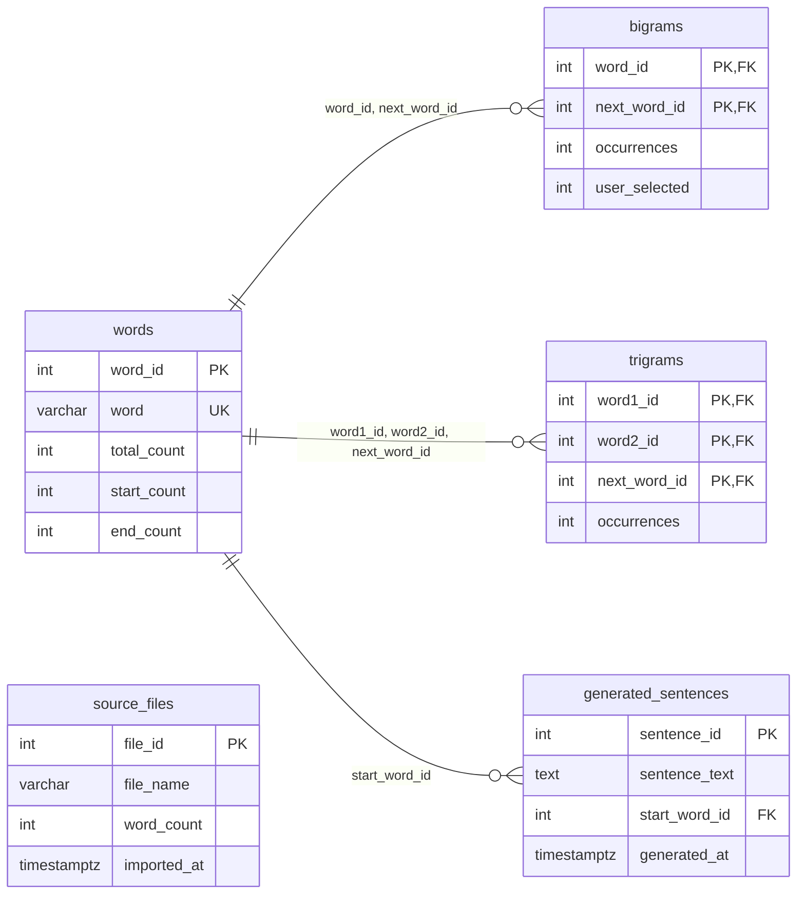

```mermaid
erDiagram
    direction LR

    words {
        int word_id PK
        varchar word UK
        int total_count
        int start_count
        int end_count
    }

    bigrams {
        int word_id PK, FK
        int next_word_id PK, FK
        int occurrences
        int user_selected
    }

    trigrams {
        int word1_id PK, FK
        int word2_id PK, FK
        int next_word_id PK, FK
        int occurrences
    }

    generated_sentences {
        int sentence_id PK
        text sentence_text
        int start_word_id FK
        timestamptz generated_at
    }

    source_files {
        int file_id PK
        varchar file_name
        int word_count
        timestamptz imported_at
    }

    words ||--o{ bigrams : "word_id, next_word_id"
    words ||--o{ trigrams : "word1_id, word2_id, next_word_id"
    words ||--o{ generated_sentences : "start_word_id"
```
